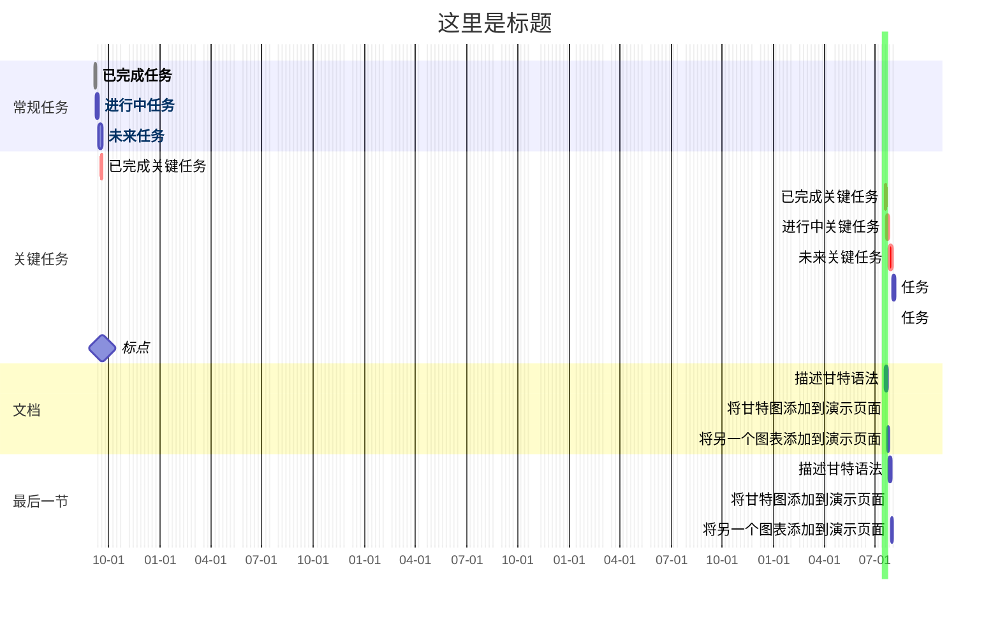

#软件/obsidian  #插件

excludes    weekends 
> 排除周末
> 接受  "YYYY-MM-DD"  "sunday"  "weekends"

todayMarker stroke-width:5px,stroke:#0f0,opacity:0.5
> 今天标记
> 若要隐藏，写“todayMarker off”

click 任务ID href "ob链接"  
> 给任务添加点击时间