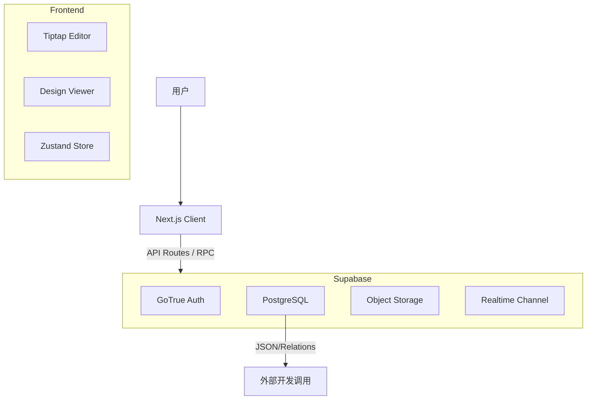

# 设计规范管理系统 - 技术实现方案

## 1. 技术架构总览

### 1.1 技术栈选型
| 模块 | 技术选型 | 说明 |
| :--- | :--- | :--- |
| **前端框架** | **Next.js 14+** (App Router) | 利用 SSR 提升首屏加载速度，SEO 友好（便于文档索引），API Routes 提供对外接口。 |
| **编辑器内核** | **Tiptap (Pro)** | 无头编辑器，易于扩展自定义节点（标注、资源卡片），支持 React Node Views。 |
| **后端/数据库** | **Supabase** | 提供 Auth (鉴权)、PostgreSQL (结构化数据)、Storage (资源存储)、Realtime (协作)。 |
| **状态管理** | **Zustand** | 轻量级全局状态管理，用于处理多层级组件间的资源选中、高亮联动。 |
| **UI 组件库** | **Shadcn/UI + Tailwind CSS** | 快速构建现代化的后台管理界面。 |
| **图形处理** | **Fabric.js** 或 **原生 SVG** | 用于在 Tiptap Node View 中实现复杂的图片标注（绘图、拖拽、缩放）。 |

### 1.2 系统架构图


---

## 2. 数据库设计 (Supabase PostgreSQL)

基于三级结构（流程-页面-资源）及复用需求，采用关系型数据库设计。

### 2.1 核心表结构 (ER Model)

#### `profiles` (用户表 - 扩展 Supabase Auth)
- `id`: uuid (PK, fk auth.users)
- `role`: enum ('admin', 'editor', 'reader')
- `avatar_url`: text

#### `flows` (流程表)
- `id`: uuid (PK)
- `title`: text
- `description`: text
- `cover_url`: text
- `status`: enum ('draft', 'published')
- `created_by`: uuid
- `created_at`: timestamp

#### `pages` (页面表 - 核心单元)
- `id`: uuid (PK)
- `title`: text
- `preview_url`: text (页面预览图，强制)
- `content`: jsonb (Tiptap 文档结构数据)
- `created_by`: uuid

#### `flow_pages` (流程-页面关联表，实现 M:M 复用)
- `flow_id`: uuid (FK)
- `page_id`: uuid (FK)
- `sort_order`: integer (排序)
- *Primary Key: (flow_id, page_id)*

#### `resources` (资源库表)
- `id`: uuid (PK)
- `title`: text
- `type`: enum ('image', 'video', 'motion', 'audio', 'color', 'text')
- `file_url`: text (资源文件地址)
- `preview_url`: text (可选，动效/视频的封面)
- `meta_data`: jsonb (结构化参数：尺寸 width/height, 格式, 色值 hex 等)
- `description`: text (非结构化描述)
- `created_by`: uuid

#### `page_resource_refs` (引用追踪表)
*用于快速查询引用关系，虽 Tiptap JSON 中包含此信息，但独立表方便 SQL 查询和级联删除检查。*
- `page_id`: uuid (FK)
- `resource_id`: uuid (FK)
- `annotation_type`: enum ('point', 'box', 'overlay')
- `created_at`: timestamp

#### `snapshots` (版本管理表)
- `id`: uuid
- `target_type`: enum ('flow', 'page')
- `target_id`: uuid
- `version_name`: text
- `data_snapshot`: jsonb (完整的数据快照)
- `created_at`: timestamp

### 2.2 Row Level Security (RLS) 策略
- **Admin**: 全局 CRUD。
- **Editor**: `flows`/`pages`/`resources` 的 INSERT/UPDATE/DELETE。
- **Reader**: 仅 SELECT `status = 'published'` 的内容。

---

## 3. 核心功能实现方案

### 3.1 编辑器与标注系统 (Next.js + Tiptap)

这是系统的核心难点。我们需要开发一个自定义的 Tiptap Node：`PagePreviewNode`。

#### 3.1.1 `PagePreviewNode` 实现逻辑
该节点在编辑器中渲染为一个 React 组件 (Node View)。

**组件结构：**
```jsx
<div className="relative group">
  {/* 1. 页面底图 */}
  

  {/* 2. 标注覆盖层 (Overlay Layer) */}
  <div className="absolute inset-0 pointer-events-none">
    {/* 遍历 annotations 渲染 */}
    {annotations.map(anno => (
      <AnnotationItem 
        key={anno.id}
        type={anno.type} // point, box, overlay
        position={{x: anno.x, y: anno.y}} // 百分比定位
        resource={anno.resource}
        isEditing={isEditing}
      />
    ))}
  </div>
  
  {/* 3. 交互层 (用于绘制) */}
  {isEditing && (
    <div className="absolute inset-0 pointer-events-auto" onMouseDown={handleDrawStart} />
  )}
</div>
```

#### 3.1.2 三种标注的实现细节
所有坐标均存储为 **百分比 (0-100%)**，以适应不同屏幕宽度的响应式展示。

1.  **标点标注 (Point)**:
    -   渲染：绝对定位的 `div`，CSS `left: x%`, `top: y%`。
    -   内容：显示索引数字。
2.  **高亮边框 (Box)**:
    -   数据：`x, y, width, height` (均为百分比)。
    -   渲染：带边框颜色的 `div`。
    -   交互：使用 `react-rnd` 或类似库实现拖拽调整大小。
3.  **高级分层 (Overlay/Layer)**:
    -   数据：`x, y, width, height, scale, opacity`。
    -   渲染：渲染 `resource.preview_url` 图片，通过 `z-index` 叠加在底图之上。
    -   场景：UI 走查时，将设计原图叠加在开发截图上对比；或展示具体 Button 组件在页面中的位置。

#### 3.1.3 数据同步
当用户在 Tiptap 中添加标注时：
1.  更新 Tiptap JSON 内容。
2.  **异步钩子**：触发 Supabase 写入 `page_resource_refs` 表，确保 SQL 层面的引用关系更新。

### 3.2 资源管理与复用

#### 3.2.1 资源上传与提取
- **拖拽上传**：使用 Tiptap `Extension-File-Handler`。
- **自动处理**：
    -   图片：通过 Canvas 或 Sharp (Next.js API) 自动提取宽、高。
    -   色值：需提供取色器 UI，手动录入或识别。
- **存储**：上传至 Supabase Storage `bucket: resources`。

#### 3.2.2 全局更新机制
- 由于 `resources` 是独立表，页面中仅存储 `resource_id`。
- **前端渲染**：组件加载时，根据 IDs 从 Supabase `resources` 表 fetch 最新数据 (SWR 或 React Query)。
- **效果**：一旦在资源库更新了某个 ICON 的图片，所有引用该 ID 的页面重新 fetch 时都会展示新图。

### 3.3 搜索与导航 (PostgreSQL Full Text Search)

利用 Supabase 的 PG 扩展能力。

#### 3.3.1 搜索引擎实现
在 `flows`, `pages`, `resources` 表上创建 `tsvector` 索引。
```sql
-- 示例：资源表搜索索引
alter table resources add column search_vector tsvector
generated always as (to_tsvector('english', title || ' ' || description)) stored;

create index resources_search_idx on resources using GIN (search_vector);
```
**API 接口**：`/api/search?q=Login` -> 执行 SQL `websearch_to_tsquery`。

#### 3.3.2 引用反查
- **查询资源被谁引用**：
  ```sql
  select p.title, p.id from pages p 
  join page_resource_refs ref on ref.page_id = p.id 
  where ref.resource_id = 'target-uuid';
  ```

---

## 4. 对外数据接口 (API For Devs)

为了满足“自动化层面”的需求，系统需提供标准化 JSON 接口供开发脚本调用。

### 4.1 接口鉴权
使用 Supabase 生成的 **Service Role Key** 或允许用户生成 **Personal Access Token (PAT)**。

### 4.2 API 路由设计 (Next.js Route Handlers)

#### `GET /api/v1/specs/flow/{flow_id}`
返回完整流程数据，包含嵌套的页面和资源参数。
```json
{
  "id": "flow_123",
  "name": "登录流程",
  "pages": [
    {
      "id": "page_abc",
      "name": "输入手机号页",
      "preview_url": "...",
      "resources": [
        {
          "id": "res_btn_primary",
          "name": "主按钮",
          "type": "component",
          "specs": {
            "width": 320,
            "height": 48,
            "radius": 8,
            "color": "#007AFF"
          },
          "annotations": {
             "type": "box",
             "rect": [10, 50, 80, 10] // x, y, w, h %
          }
        }
      ]
    }
  ]
}
```

---

## 5. 协作与版本控制

### 5.1 实时协作
- 利用 **Tiptap Hocuspocus** 或 **Supabase Realtime**。
- **光标感知**：显示谁正在查看当前页面。
- **锁机制**：虽然全实时协作复杂，可简化为“编辑锁”——当一人编辑某页面时，他人只读，避免冲突。

### 5.2 版本发布 (Snapshot Strategy)
- **Draft Mode**: 编辑时直接修改 `pages` 表的 `content` 字段。
- **Publish Action**:
    1.  触发 API `/api/publish`。
    2.  将当前 `content` JSON 复制一份，插入 `snapshots` 表。
    3.  更新 `version_number`。
- **版本回滚**：将 `snapshots` 中的 JSON 覆盖回 `pages` 表。

---

## 6. 开发计划分期

### 第一阶段：核心编辑器与资源库 (MVP)
1.  搭建 Next.js + Supabase 基础环境与 Auth。
2.  实现资源库 CRUD，支持上传图片。
3.  集成 Tiptap，开发 `ImageBlock` 基础节点。
4.  实现“标点标注”功能。

### 第二阶段：结构化与高级标注
1.  实现流程-页面-资源的三级关联。
2.  开发“高亮边框”与“分层标注”功能。
3.  实现资源引用追踪（引用计数、防误删）。

### 第三阶段：阅读体验与开放能力
1.  开发“流程视图”与“页面视图”的前端展示模式。
2.  实现全文搜索。
3.  开发 `/api/v1` 对外标准接口。
4.  版本管理与发布流程。

---

## 7. 关键风险与对策

| 风险点 | 对策 |
| :--- | :--- |
| **图片加载性能** | 页面包含大量高分预览图，需使用 Next.js `<Image>` 组件优化，并在上传至 Supabase 时触发 Edge Function 进行缩略图压缩。 |
| **标注位置偏移** | 必须严格强制使用**百分比坐标**，并监听 ResizeObserver，处理窗口缩放问题。 |
| **数据一致性** | 资源元数据（如尺寸）修改后，页面标注框比例可能失效。对策：资源更新仅更新内容，若尺寸大改，需在页面中标注“资源已更新，请检查”提示。 |

